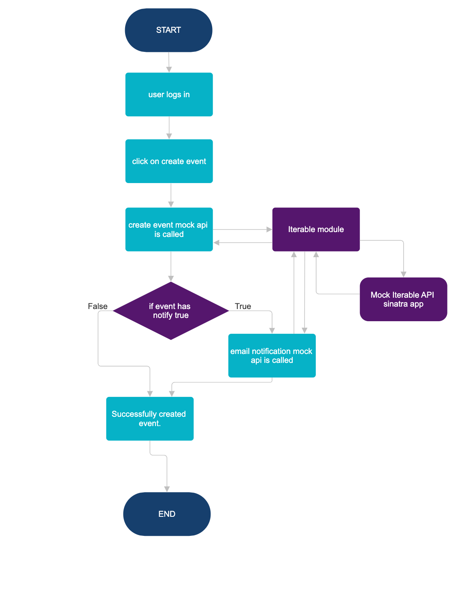

##### Prerequisites

The setups steps expect following tools installed on the system.

- Github
- Ruby [3.0.6]
- Rails [7.1.1]


##### 1. Create and setup the database

Run the following commands to create and setup the database.

```
bin/rails db:setup
```

##### 2. Start the Rails server

You can start the rails server using the command given below.

```
bin/rails s
```

And now you can visit the site with the URL http://localhost:3000

##### 3. Credentials

You can use any of the below credentials which were created during seed.

```
 user1: user1@example.com / 123456
 user2: user2@example.com / 123456
 user3: user3@example.com / 123456
```

#### 4. Gems used

Below gems are used in various places wherever required.

- Sinatra
- devise
- httparty
- faker

#### 5. Mock API setup

I have sinatra framework for setting up the mock api which is quick to start and implement. defined routes similar to Iterable API. 

I have mounted the sinatra app in config.ru file which boots up along with the rails app. The sinatra app is suffixed or mapped with `/api` to differentiate and match with Iterable API.

#### 6. Authentication

I have used devise gem for users authentication.

#### 7. Static data

As we are using only two events in the given scenario. I have created Event model which includes only required modules (i.e `include ActiveModel::Model`, `include ActiveModel::Attributes`) as per use case.

I have created `Events` class which has `@events` class variable initialized as hash. There is a `add` method which is used to store event objects. `get` method to retrieve an event. This `Events` class will store the event objects added during initialization of app. These can be used as and when required.

#### 8. Approach

I have built 4 mock apis for event creation, list events, sending emails, list sent emails. These are written in sinatra app which serve as mock api server.

Now these apis can be called from Iterator module. In the Iterator module I have used `httparty` gem which is used for calling api urls and collect responses of the same.

Now this Iterable module can be used through out the app for calling mock apis.

I have used this Iterable module in home controller on appropriate actions.

Now the home page or default landing page has two buttons.

Button 1 for creating Event A assocaited with user logged in.
Button 2 for creating Event B assocaited with user logged in.

when Button 1 is clicked the `create_event` action is triggered as per url which has Iterable module.

Iterable module create_event method calls the mock api for creating event.

create event takes event id as param. event object which has notify attribute as true will initiate the email notification Iterable mock API using Iterable module.

Data (events, emails sent) does not persist in mock api after restarting the app.

#### 8. Flow Diagram

I have added a small flow diagram.

